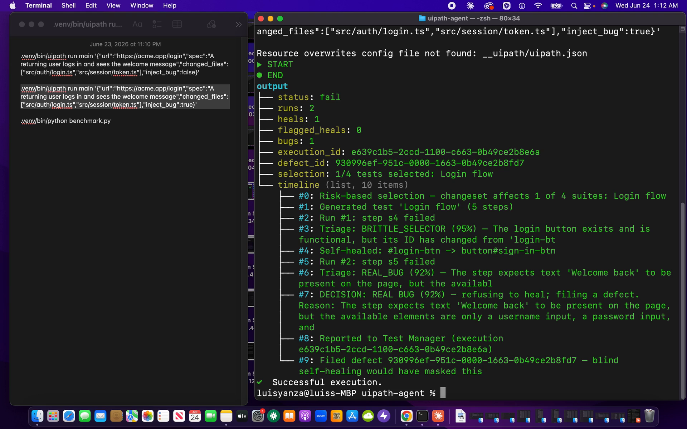
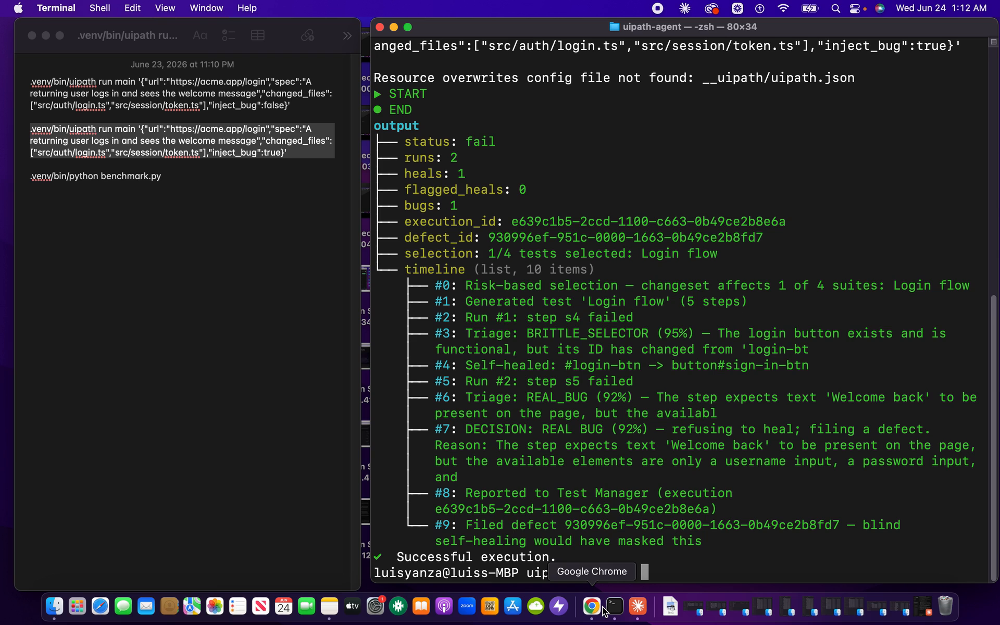
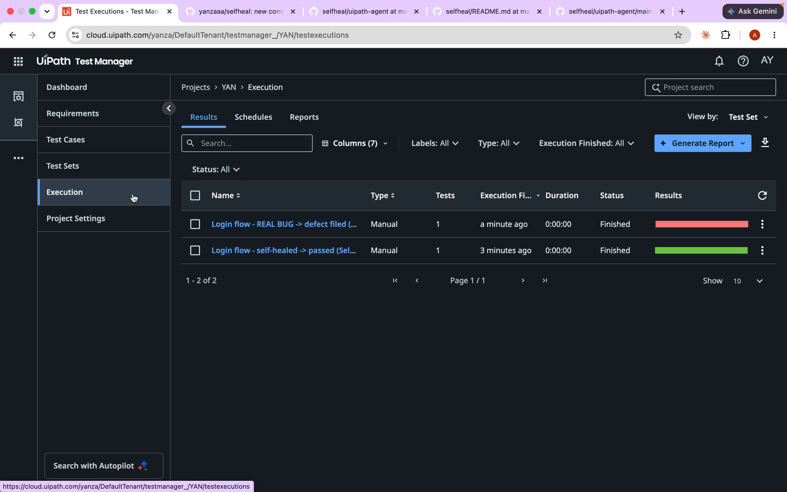
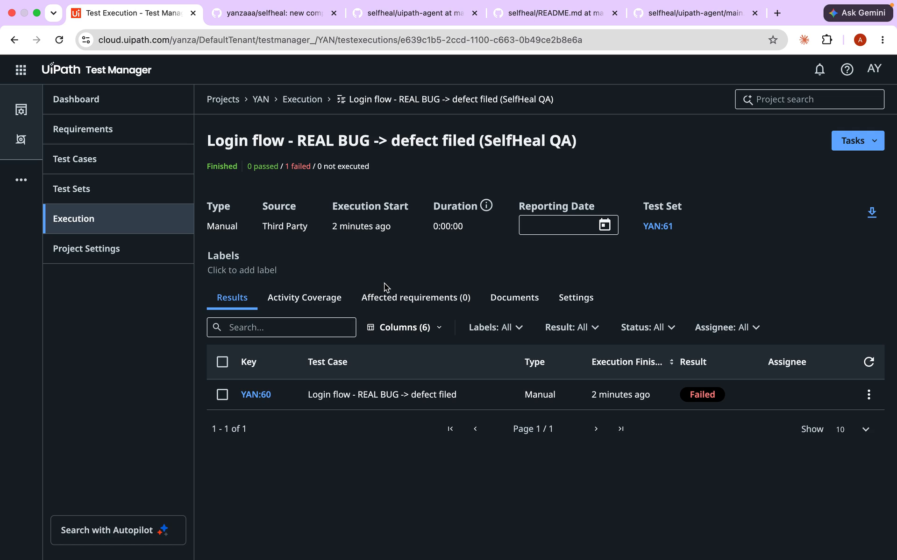
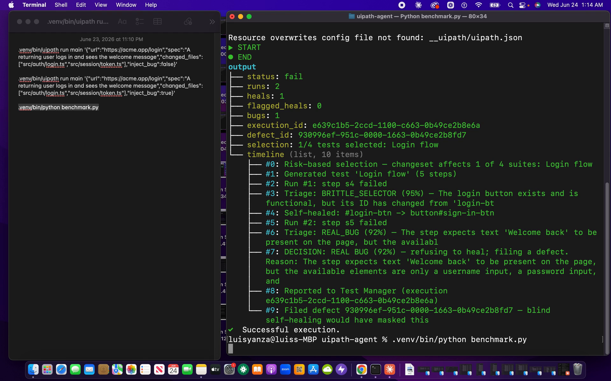
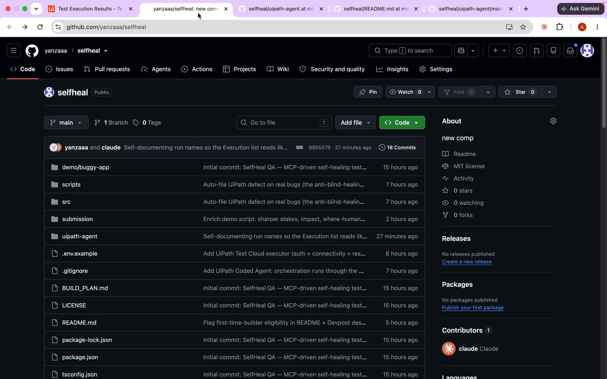
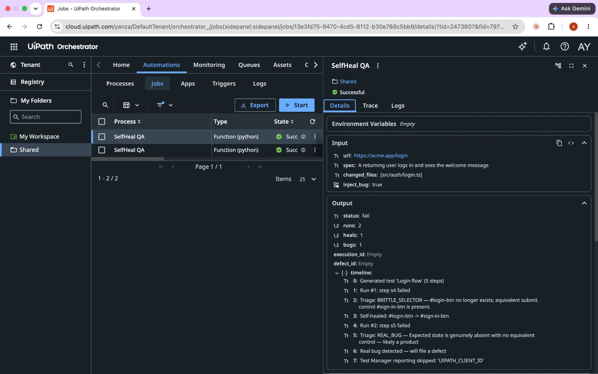

# SelfHeal QA: the test agent that knows when *not* to heal

> **UiPath AgentHack · Test Cloud track · first-time UiPath builder · built solo, end to end, with Claude Code.**

Brittle UI tests are the #1 reason teams abandon test automation. Self-healing fixes broken locators automatically, but it has a dangerous blind spot: **it can heal right past a real bug and ship the regression.**

**SelfHeal QA is a UiPath coded agent that heals brittle locators *and knows when not to*.** Give it a URL and a plain-English spec. It generates the test, runs it, and on failure it **triages the root cause**: `BRITTLE_SELECTOR` vs `REAL_BUG`. Brittle? It rewrites the locator from the live DOM and re-runs. Real bug? It **refuses to heal** and **files a defect in UiPath Test Manager** instead of masking it.

```
spec ─▶ generate ─▶ run ─▶ pass ✅
                      │
                    fail ❌ ─▶ triage (LLM)
                                 ├─ BRITTLE_SELECTOR ─▶ rewrite locator ─▶ re-run ↺
                                 └─ REAL_BUG ─────────▶ file defect in Test Manager 🐞
```

## See it in action
| Heal a brittle locator → green | Refuse a real bug → file a defect |
|---|---|
|  |  |
| **Self-documenting runs in Test Manager** | **Source: Third Party + filed Defect** |
|  |  |
| **Adversarial benchmark: 0% false-negative, 16/16** | **Runs as a UiPath coded agent** |
|  |  |

**Verified on the platform.** The published package ran as a **serverless Orchestrator job** (`Successful`) — proof the agent executes live on UiPath (`orchestrator-job.json`, screenshot 07). The **restraint behavior** itself — self-healing a drifted locator but **refusing** to heal a real regression and filing it as a defect — is proven by the **Test Manager** runs that call Test Manager v2 directly (screenshots 03/04), the **adversarial benchmark** (16/16, 0% false-negative), and the **12 unit tests** that pin the confidence/error-state gate (including a cross-language parity test that the TS and Python gates use the same floor and signals). (Republishing the latest **v0.2.0** package to the hackathon tenant surfaces the full select → triage → refuse timeline on-platform as well — see [`submission/UIPATH-DEPLOY.md`](submission/UIPATH-DEPLOY.md).)



## Why it's different: restraint, enforced in code
Every self-healing tool optimizes for **heal coverage**. Autopilot for Testers, Testim, mabl, and Healenium all race to fix as many broken locators as possible. SelfHeal QA inverts the objective function: its novelty is knowing **when *not* to heal**. It withholds the heal when the failure is a genuine regression and turns that judgment into an auto-filed Test Manager defect, going straight at the biggest risk of autonomous QA: **silent regressions masked by over-eager healing.**

Crucially, the restraint is **enforced in code, not just asked of the model.** The triage *verdict* (`REAL_BUG` vs `BRITTLE_SELECTOR`) is live-model judgment, but the *gate that acts on it is deterministic code*: the guardrail in [`src/heal.ts`](src/heal.ts) (mirrored in [`uipath-agent/main.py`](uipath-agent/main.py)) refuses to apply a heal when model confidence is below a floor (`< 0.7`) **or** the page snapshot shows an error/alert state — because a real bug often masquerades as a drifted selector. A low-confidence or error-state case is never silently rewritten; it is escalated for human review. This invariant is unit-tested (`npm test`, see [`tests/heal.test.ts`](tests/heal.test.ts)).

The pattern generalizes: **heal-vs-refuse restraint applies to any autonomous agent that mutates state on failure** — not just locator healing. It is a reusable principle (act when confident and safe; escalate otherwise), the same one behind the author's refund-triage agent.

## What's proven (and what isn't)
Honesty for judges: the demo app states are **seeded fixtures**, the benchmark is a **small, author-curated set (n=16)** weighted toward adversarial look-alikes, and the verdicts are **live Claude** decisions (`triage_engine: live-claude` in [`benchmark-results.json`](submission/benchmark-results.json); the harness refuses to record a fallback run as a valid result). The safety property is **LLM judgment grounded by the live DOM and gated by deterministic code** — a strong engineered guardrail, not a formal proof. The on-platform run is real (serverless Orchestrator job, `Successful`).

## Runs through the UiPath Platform
The orchestration is a **UiPath coded agent** (`uipath-agent/`, Python, scaffolded, run, and published with the `uipath` CLI; it calls UiPath **Identity** and **Test Manager v2** REST APIs directly): `select → generate → run → triage → heal/file-defect → report`. It runs via the UiPath runtime and is **published to the Orchestrator tenant feed** (`uipath pack` + `uipath publish --tenant`).

```bash
cd uipath-agent
.venv/bin/uipath run main '{"url":"https://demo.local/login","spec":"login and see Welcome back","inject_bug":true}'
# → self-heals the selector, catches the real bug, files a defect in Test Manager
```

## UiPath components used
**Agent Type: Coded Agent** — Python, scaffolded, run, and published with the `uipath` SDK/CLI. This is a **Coded Agent**, not a low-code agent, and not a mix.

- **Coded Agents** — the orchestration and agent logic (`uipath-agent/`), scaffolded/run/published with the `uipath` CLI + SDK
- **Orchestrator** — the agent is published to the tenant package feed and executed as a **serverless job** (`Successful`, see `submission/orchestrator-job.json`)
- **Test Manager v2** — test cases, test sets, executions, test-case logs, and auto-filed **defects**
- **Identity** — external-application client-credentials auth for the platform API calls
- **API Workflows** — the agent calls the Test Manager v2 and Identity **REST APIs** directly from code
- **UiPath for Coding Agents** — built end to end with **Claude Code**

## Live browser demo (companion Playwright executor)
A TypeScript executor drives a real Chromium so you can watch the heal happen on an actual page:

```bash
npm install && npm run pw:install
cp .env.example .env          # set ANTHROPIC + UiPath creds
npm run run -- --url "file://$PWD/demo/buggy-app/index.html" \
  --spec "A returning user logs in and sees Welcome back" \
  --executor uipath --headed   # heals live + reports to Test Manager
```
Add `?bug=1` to the URL to see the agent correctly **file a defect** instead of healing.

**Verified on-platform run:** the published package was executed as a job on Orchestrator's **Default Serverless** runtime and completed **`Successful`** in 10.2s (job `d5d3c7f6-bd39-4417-ad2c-aa9bc78e7b28`), captured in [`submission/orchestrator-job.json`](submission/orchestrator-job.json).

Key-free demo (no API keys, mock execution): `npm run demo`.

## Setup & run (for judges)
**Prerequisites:** Node 20+ and npm. (Python 3.11+ is only needed for the optional on-platform coded-agent run; the demo and tests below need no keys and no Python.)

**1 — Clone & install**
```bash
git clone https://github.com/yanzaaa/selfheal && cd selfheal
npm install
```

**2 — Fastest check: key-free demo (no API keys, ~10s).** Runs the full loop on seeded fixtures — a brittle locator is healed and the test passes; a real bug is **refused** and a defect is filed:
```bash
npm run demo
```

**3 — The guardrail tests** (pins the restraint invariants: confident heal applied; low-confidence or error-state heal withheld; real bug filed):
```bash
npm test
```

**4 — Live browser demo (optional):** watch the heal happen on a real Chromium page:
```bash
npm run pw:install
npm run run -- --url "file://$PWD/demo/buggy-app/index.html" \
  --spec "A returning user logs in and sees Welcome back" --headed
# add ?bug=1 to the URL to watch it file a defect instead of healing
```

**5 — On-platform UiPath Coded Agent (optional; needs a UiPath tenant):**
```bash
cp .env.example .env        # set UiPath Identity client creds (+ ANTHROPIC_API_KEY for live triage)
cd uipath-agent
.venv/bin/uipath run main '{"url":"https://demo.local/login","spec":"login and see Welcome back","inject_bug":true}'
```
Runs the published Coded Agent end to end: `select → generate → run → triage → heal / file-defect → report`. The same package executed on Orchestrator's Default Serverless runtime (`Successful`). Full deploy steps: [`submission/UIPATH-DEPLOY.md`](submission/UIPATH-DEPLOY.md).

## How it works
| Piece | Where | Job |
|---|---|---|
| Coded agent | `uipath-agent/main.py` | orchestration brain on UiPath: generate → run → triage → report |
| LLM triage | Claude (Anthropic) | bug-vs-brittleness and selector rewrite, with deterministic fallback |
| Test Manager client (on-platform) | `uipath-agent/main.py` | cases / sets / executions / logs / **defects** — the path verified on Orchestrator |
| Playwright executor (live demo) | `src/executor/playwright.ts`, `src/executor/uipath.ts` | real-browser execution; the TS Test-Manager write is a thin companion for the local demo, the Python agent is the reporting path that ran on-platform |
| Agent loop / healer + restraint gate | `src/agent.ts`, `src/heal.ts` | self-heal loop, triage, and the code-enforced heal guardrail |

## Tests
`npm test` (Vitest) pins the restraint invariants in [`tests/heal.test.ts`](tests/heal.test.ts): a confident heal on a clean page is applied; a low-confidence heal is **withheld** (locator never rewritten); a confident heal on an **error-state page is still withheld**; a real bug is filed; and the full agent loop heals-then-passes, refuses-then-flags, or files-a-bug. The Python benchmark ([`uipath-agent/benchmark.py`](uipath-agent/benchmark.py)) adds 16 labeled cases incl. 3 adversarial look-alikes.

## License
MIT © 2026 Anthony Yanza
